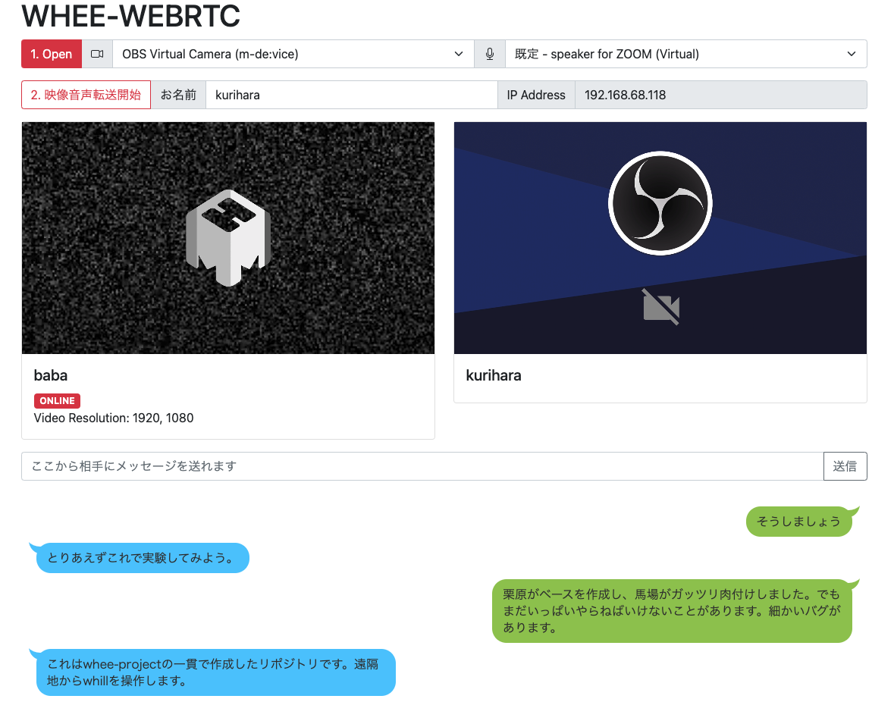

# WHEE-WEBRTC

rtcでブラウザ間で高画質画像と音声を送信しながら遠隔地からwheeを操作する実験的プロジェクト。本リポジトリは東京都立大学5Gプロジェクトのの一貫で作成されました。

## 使い方

1. npmもしくはyarn等で以下のライブラリをインストール
- express
- soket.io
- serialport

2. `node server.js`
3. ブラウザで https://[ip address]:1337 にアクセス
4. 証明書が不正との警告がでるので、ブラウザ画面を選択した状態で、thisisunsafe とキーボード入力することでアクセスできる。ここがちょっと分かりづらいですが、単純に該当するブラウザウィンドウを選択している状態で、「thisisunsafe」とキーボードで打ち込んでください。RTC接続ではhttpsが必須なので、ローカル環境でhttpsが実行できるようにこのような作業が必要です。

## アプリケーションの使い方
1. 最初にOpenボタンで、デバイス（ビデオとオーディオ両方）を開きます。
2. チャットを利用して、相手もビデオとオーディオを開いたかどうかを確認
3. 確認ができたらどちらか一方が「映像音声転送開始」ボタンを押す