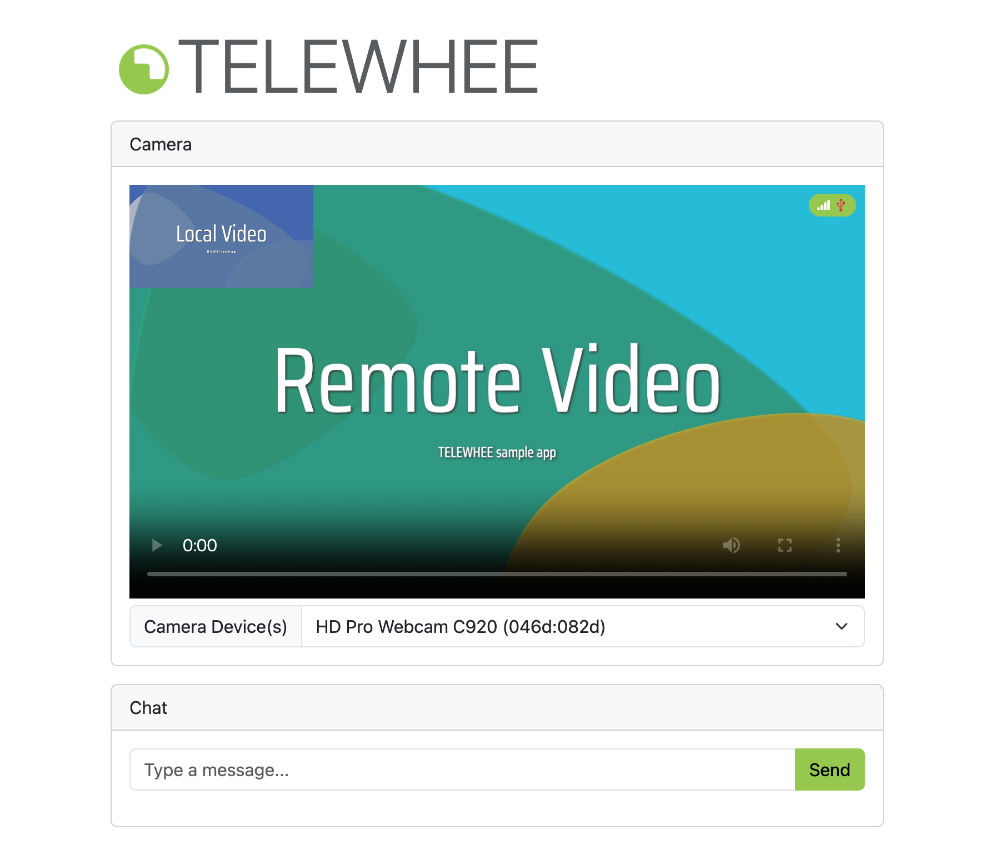

# TELEWHEE
> [!IMPORTANT]
> 本リポジトリを利用して発生したいかなる損害についても、一切の責任を負いかねます。自己責任でご利用ください。車いすの操作にはWHILL Model CRが必要です。また、遠隔地からの操作は利用場所によっては法的に問題が生じる可能性がありますので、ご利用の際は十分に注意してください。

> [!Note]
> TELEWHEEのソースはAAC025の発表に合わせて公開予定です．

多くのユーザが利用、開発できるよう，なるべくコストをかけずにWebRTCでブラウザ間で高画質画像と音声を送信しながら遠隔地から電動車いすwhillを操作する実験的プロジェクト。本リポジトリは東京都立大学5Gプロジェクトの一貫で作成されました。


## Getting Started
### 同じPC内で接続をする方法（動作確認用）
1. cloneとnpmでライブラリをインストール
```bash
git clone https://github.com/TetsuakiBaba/TELEWHEE.git
cd TELEWHEE/app
npm install
```
2. サーバを起動
```bash
node server.js
```
3. ブラウザで http://localhost:3000 にアクセス

### 異なるPC間で接続をする方法
Render等のnode.jsが利用可能な外部サービスに本appをデプロイしてください。

## ファイル構成
- `app/`: node.jsで動作するTELEWHEEアプリケーション本体
- `latency_logger/`: WebRTCの最小遅延時間を計測するためのプログラム
  - https://tetsuakibaba.github.io/TELEWHEE/latency_logger/
- `arduino/whill_controller/`: whillの操作を行うためのプログラム